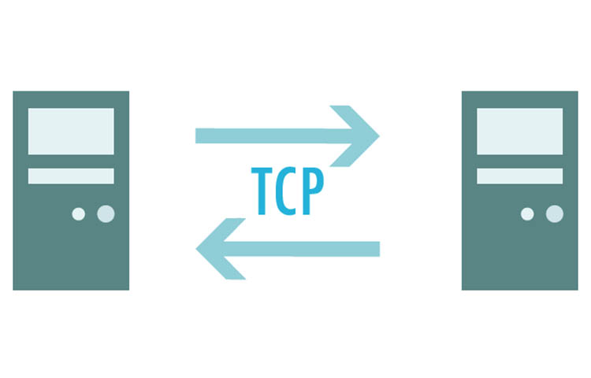

# Report 3 | Socket Programming (Transport Layer)

 

Redes y Sistemas Distribuidos - ESIT (Escuela superior de Ingeniería y Tecnología) ULL

 
 
 
 
 
 
 

 
 
 
 
 
 
 

    Report made by Éric Dürr Sierra and Noah Sánchez
                   (alu0101027005)     (alu0101134956)
 
 
 
 

<!-- end of cover page --->
***

The following document contains the sections which will introduce the different stages of the assignment of *socket programming* ( 3rd assignment ). All you will see
along this report will reffer to concepts of the fifth TCP/IP network layer ( Transport ).

This document will also include evidences of the teamwork ( as done in previous reports ) and a list of the system functions used for this assignment code.

 
 
 

## **Index** &emsp;&emsp;&emsp;&emsp;&emsp;&emsp;&emsp;&emsp;&emsp;&emsp;&emsp;&emsp;&emsp;&emsp;&emsp;&emsp;&emsp;&emsp;&emsp;&emsp;&emsp;&emsp;&emsp;&emsp;&emsp;Page:
 

## 1. [Description of developed aplications](#id1)
## 2. [Description of developed protocol](#id2)
## 3. [Guide for compilation and execution steps](#id3)
## 4. [Test cases](#id4)
## 5. [Appendix: Source code](#id5)

 
 
 
 
 
 
 
 
 
 
 
 
 
 
 
 
 
 
 
 

***

<!-- end of index page --->
 
 
 
 
 

## 1. Description of developed aplications.
 
 

 
 
 
 

## 2. Description of developed protocol.
 
 

 
 
 
 

## 3. Guide for compilation and execution steps
 
 

 
 
 
 

## 4. Test cases
 
 

 
 
 
 

## 5. Appendix: Source code.
 
 

 
 
 
 
