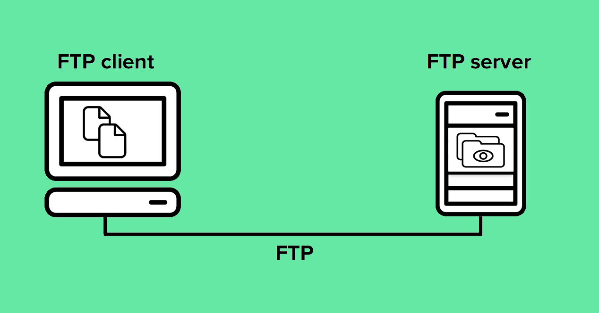
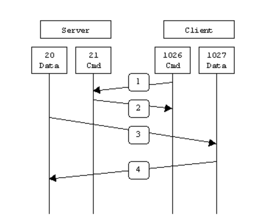
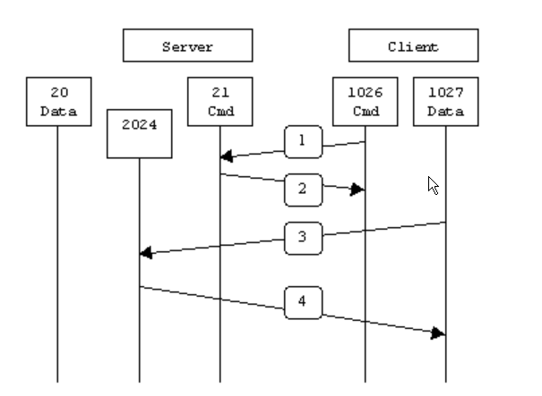

# Report 3 | Socket Programming (Transport Layer)

<br>

Redes y Sistemas Distribuidos - ESIT (Escuela superior de Ingeniería y Tecnología) ULL

<br>
<br>
<br>
<br>
<br>
<br>
<br>


<br>
<br>
<br>
<br>
<br>
<br>
<br>

    Report made by Éric Dürr Sierra and Noah Sánchez
                   (alu0101027005)     (alu0101134956)
<br>
<br>
<br>
<br>

<!-- end of cover page --->
***

The following document contains the sections which will introduce the different stages of the assignment of *socket programming* ( 3rd assignment ). All you will see
along this report will reffer to concepts of the fifth TCP/IP network layer ( Transport ).

This document will also include evidences of the teamwork ( as done in previous reports ) and a list of the system functions used for this assignment code.

<br>
<br>
<br>


## **Index** &emsp;&emsp;&emsp;&emsp;&emsp;&emsp;&emsp;&emsp;&emsp;&emsp;&emsp;&emsp;&emsp;&emsp;&emsp;&emsp;&emsp;&emsp;&emsp;&emsp;&emsp;&emsp;&emsp;&emsp;&emsp;Page:
 

## 1. [Description of developed aplications](#id1)
## 2. [Description of developed protocol](#id2)
## 3. [Guide for compilation and execution steps](#id3)
## 4. [Test cases](#id4)
## 5. [Appendix: Source code](#id5)


<br>
<br>
<br>
<br>
<br>
<br>
<br>
<br>
<br>
<br>
<br>
<br>
<br>
<br>
<br>
<br>
<br>
<br>
<br>
<br>

***

<!-- end of index page --->
<br>
<br>
<br>
<br>
 
<div id="id1">

## 1. Description of developed aplications.
<br>
<br>

In this section we will explain all the code related to the functions which we had to develop. In short, all the code segments which were necessary to have a server working in order to receive messages from te client, understand them and apply the right responses.

We will separate the explanation in the two classes manipulated in order to focus the methods work in the right scope.

Before explaining the two main classes of this assignment is worth stressing that the main file ( [ftp_server.cpp](../src/ftp_server.cpp) ) has the responsibility to run the server object and handle the *sigactions*. Going beyond the functionalities the FTP server object will handle them all in an enclosed way.

We wont develop a FTP client, indeed we will use the *ftp* linux native program wich is worth developed with all the functionalities (and more) that we are going to test. 

### **FTPServer class**

This class basically starts up the server that will handle the tasks of creating and binding a socket for TCP communication. To achieve this we must develop the *`define_socket_TCP()`* method ( which will be explained in the following lines ). Also this class is ment to create a *ClientConnect* object which will handle all the connections, commands and specific functions under the execution of the server object. FTP server is made to controll all the running proccess, the endless loop of comunication and the the stopping action.

A more detailled look at *`the define_socket_TCP()`* method will show us that this method creates a TCP socket by passing to it the port that we will connect (which is given by the class Constructor). Under this method we are just applying all the basic data to the socket address structure object ( `struct sockaddr_in sin` ). We must complete all the fields like this:

```c
    memset(&sin, 0, sizeof(sin));
    sin.sin_family = AF_INET;         
    sin.sin_addr.s_addr = INADDR_ANY; 
    sin.sin_port = htons(port);       
```
> `memset()` will set the first bytes of the block of memory pointed by sin in relation with the struct size.

> The two first fields are related to the socket data which will be explained in a few lines. 

> The port field is initiated as the given port argument but translating the integer value into host byte order. 

After applying all the parameters to the addres structure we must execute the `socket()` function and storing the socket file descriptor given:

```c
    s = socket(AF_INET, SOCK_STREAM, 0); 
```
> ***s*** must be possitive if the socket was created correctly.

> Notice that the **AF_INET** argument is used to create a TCP socket

Right after the instantiation of the socket we must bind it to the address previously mentioned. To do this *C* provides us the `bind()` function. Once the socket is binded we must check for the resources. To check this we have to execute another *C* socket library function which is `listen()`.

The ussage of those functions should look like this:

```c
    bind(s, (struct sockaddr *) &sin, sizeof(sin));
```
> The socket ( ***s*** ) is binded to the address ( ***sin*** )

```c
    listen(s, 5);
```
> ***s*** is reffering to the socket as a File Descriptor

Also both of the functions are checked. If they fail the `errexit()` common function is executed launching an error message and stopping the server.


### **ClientConnect class**

The ***ClientConnect*** class will focus into the conection handling functions, principally in the interpretations of the **FTP commands** that will receive from the client. Also this class must know how to connect to a TCP socket, so the method *`connect_TCP()`* will do this job.

Basically will create an empty socket by given the *0* port and creating an address as done before in order to have a "copy" of the connection. Specially used with "PORT" command. The method is quite similar to *`define_socket_TCP()`*, but instead of binding we are connecting to a socket so we must use the `connect()` *C* function.

```c
    connect(s, (struct sockaddr *)&sin, sizeof(sin))
```
> The arguments are the same as the given to `bind()` but the purpose is to connect a socket.


Entering into the comunication proccess, once the socket is conected, the *`WaitForRequests()`* method will start a *while* loop if all the steps before succeded (constructor and connection mostly) until the quit attribute switches to `true` value.

Once we enter the loop the client is "scanned" with the *`fscanf()`*  which will receive the file descriptor which is linked to the client proccess. Through this sentence we will be able to check which command is given from the client and give a response generated in the ***ClientConnection*** object. The server is prepared to react to the following commands:
- USER ( provides username information from client )
- PASS ( provides password information from client and checks it at server )
- PWD  ( solitude from the client to show the current directory )
- CWD  ( solitude from the client to access a directory )
- PORT ( communicates the port when non passive mode )
- PASV ( turns the server in passive mode )
- STOR ( launched in order to put files in the server )
- RETR ( launched in order to get files from the server )
- LIST ( the client launch this to receive a list of the documents in the working directory )
- SYST ( provides system information from client )
- TYPE ( provides type of file information )
- QUIT ( given by the client to launch the quitting proccess )


All the commands will use a few *C* system functions library to manipulate client and server messages and exchange information.

```c
    fscanf(fd, "%", variable);
```
> This function reads information from the client. The client is specified using the File Descriptor (fd), and the readed value is stored in the variable given as argument.

```c
    fprintf(fd, "%", variable);
```
>This function allow us to print text in the client. Uses the same arguments as the previous function when data from a variable must be written. We can also write a raw string without variable data.


```c
    strcmp("", "");
```

> Mostly used when we want check the given information from the client. This function returns 0 when the strings compared are equal. ( for example checking a password in PASS command).

```c
    getcwd(variable, size);
```
> Allow us to interact with the directory.

All these functions are just a part of all the used to develop the commands. But in summary all the commands must read and write from client as well as read and write information between the two sockets. Socket manipulation, in some cases is necessary, specially when we must provide the port or turn into the passive mode.

Taking a look to the PASV command, which will allow us to switch between non passive and passive state in the server we can see that a few specific steps were taken:

- the passive flag (`p_mode`) from the class is turned to `true`.
- a default socket is created with port 0 and the server IP address (given to the constructor and stored in an atribute for easier access), binded and "listened" (as done before, duplicating the same socket)
- Then we store the socket with `getsocketname()` in another socket variable (as an aux variable)
- we provide the client, with the passive mode text, information about the proccess.
- data socket file descriptor attribute is replaced with the new file descriptor   

In summary we are transfering the comunication to an auxiliar socket saving our data socket in another entity.

Then the RETR and STOR commands will allow us to exchange files through ftp with the sockets. In both commands we will:

1. Open a file instance, which depending on where is located will be oppened with two different functions (`open()` if stored and `fopen()` if retrieved) .
2. Read/Write all the information in a loop and, depending on which command we are running send or receive information. To transfer the information through the  data sockets from both sides we must use:
```c
    send(data_socket, buffer, n, 0);
```

```c
    read(data_socket, Buffer, sizeof(Buffer));
```

> Notice that the information is stored in the buffer, the it will be written in the file instance variable through the `write()` *C* system function. On the other hand when information is retrieved, the local file is read using `fread()`.


3. The loop ends when reached the and and all resources must be closed ( `close(data_socket) fclose(file`) ).

To end up the code we made a refactor of each command translating all the actions taken to a private method for each one of the developed commands, making a cleaner code. These private methods are called in each conditional from *`WaitForRequests()`*.


<br>
<br>
<br>
<br>

<div id="id2">

## 2. Description of developed protocol.
<br>
<br>

FTP is the protocol involved in this project, but what is actually FTP?

FTP stands for “File Transfer Protocol.” It’s also one of the oldest protocols in use today, and is a convenient way to move files around. An FTP server offers access to a directory, with sub-directories. Users connect to these servers with an FTP client, a piece of software that lets you download files from the server, as well as upload files to it.

<div style="display: flex; justify-content: center;">

</div>


FTP is one of the simplest, and earliest formats created to quickly move files from one device to another. In the 1980s, the FTP format was updated to the TCP/IP version associated with servers.

When files are transferred through FTP, one of two actions is happening – uploading or downloading. Uploading involves transferring files from a personal computer to a server. FTP uses TCP/IP, as mencioned before, to transfer your files. TCP/IP is basically the language that the Internet uses to carry out commands.

FTP may run in active or passive mode, which determines how the data connection is established. In both cases, the client creates a TCP control connection from a random, usually an unprivileged, port N to the FTP server command port 21.


In active mode, the client starts listening for incoming data connections from the server on port M. It sends the FTP command PORT M to inform the server on which port it is listening. The server then initiates a data channel to the client from it´s port 20, the FTP server data port.

<div style="display: flex; justify-content: center;">

</div>

In situations where the client is behind a firewall and unable to accept incoming TCP connections, passive mode may be used. In this mode, the client uses the control connection to send a PASV command to the server and then receives a server IP address and server port number from the server, which the client then uses to open a data connection from an arbitrary client port to the server IP address and server port number received.

<div style="display: flex; justify-content: center;">

</div>

Both modes were updated in late nineties to support IPv6. Further changes were introduced to the passive mode at that time, updating it to extended passive mode.

To get this FTP protocol up and running on our project, we had to use Socket programming, so we can create TCP sockets, so then, we had the tools to access a server. One socket (node) listens on a particular port at an IP, while other socket reaches out to the other to form a connection. Server forms the listener socket while client reaches out to the server.

Stages of the TCP Server in Socket Programming:

* **Socket Creation**, with the information of the protocol that is going to be used in the TCP socket.
* **Bind**, bind function binds the socket to the address and port number specified in addr.
* **Listen**, puts the server socket in a passive mode, where it waits for the client to approach the server to make a connection.
* **Accept**, It extracts the first connection request on the queue of pending connections for the listening socket, creates a new connected socket, and returns a new file descriptor referring to that socket. At this point, connection is established between client and server, and they are ready to transfer data.
* **Connect**, the connect() system call connects the socket referred to by the file descriptor sockfd to the address specified by addr.

Stages of the TCP Client in Socket Programming:

* **Socket Creation**, with the information of the protocol that is going to be used in the TCP socket.
* Conect the client to the server.


<br>
<br>
<br>
<br>


<div id="id3">

## 3. Guide for compilation and execution steps
<br>
<br>

1. Compiling the server aplication (which is the one we programmed) is as easy as executing the order `make` in a linux terminal command line. This will give an executable of the server named as ***ftp_server***. We must be located in the ***src*** subdirectory of the project repossitory to do this.

if everything ran succesfully the terminal output should look like this:
```bash
~$ make 
   g++ -g -std=gnu++0x  ClientConnection.cpp FTPServer.cpp ftp_server.cpp 
   -o ftp_server -lpthread

```

2. Once the program was compiled we can leave the server running. To do this we must run the command `./ftp_server` leaving our server working on the background and waiting for a client to connect.

3. To open a client we execute the `ftp` command in a diferent linux terminal, once done we will enter to the ftp command line interface.

4. We must connect our client to the server entering the `open` command in order to open the conection, as arguments we must provide the IP address which is `localhost` and the port `2121` in our case. If all the steps succeeded the command line should look like this:

```bash
ftp> open localhost 2121
Connected to localhost.
220 Service ready
Name (localhost:user): 
```
5. As shown by the terminal the next step is to introduce our username and then our password. If all was right the console should look lie following:

```bash
331 User name ok, need password
Password:
230 User logged in
Remote system type is UNIX.
Using binary mode to transfer files.
ftp>
```
6. From here on we will be able to interact with the server through the ftp commands in the server, such as getting files, putting files, showing the current directory, etc.

<br>
<br>
<br>
<br>


<div id="id4">

## 4. Test cases
<br>
<br>

Once the program is compiled and excuted (instructions above), wa are able to use the ftp server, in which we can manage multiple commands such as:

* **USER**:

With this command we can connect to the server with our user, then we must type in our password.

```
ftp> user
(username) John
---> USER John
331 User name ok, need password
Password: 1234
---> PASS XXXX
230 User logged in
---> SYST
215 UNIX type: L8
Remote system type is UNIX
Using binary mode to transfer files
```

When we introduce the username, the program asks for our password (PASS command), in this case, it mut be "1234", if everything works correctly, a message will tell us that we are signed in.

Also it will show the system info (SYST command).


* **PWD**

With this command the user can see where he is located.

```
ftp> pwd
---> PWD
257 Working Directory: "path/to/directory"
```

* **CWD**

With this command the user is able to switch from his current directory to another one.

```
ftp> cd ..
---> CWD ..
250 Succes, directory changed.
```

* **PASV**

With this command the user is able to switch to passive mode.

```
ftp> pass
Passive mode on
```

* **STOR**

With this command the user is able to store/put a file on the server.

```
ftp> put README
local: README remote: README
---> TYPE 1
200 ok
ftp: setsockopt (ignored): Permission denied
---> PORT 127,0,0,1,231,80
200 ok
---> STOR README
150 File ok, creating connection
250 Requested action Ok and completed.
17 bytes sent in 0.00 secs (188.6541 kB/s)
```

* **RETR**

With this command the user is able to retrieve/get a file from the server.

```
ftp> get README
local: README remote: README
ftp: setsockopt (ignored): Permission denied
---> PORT 127,0,0,1,231,80
200 ok
---> RETR README
150 File okay, oppening connection
226 Closing data connection
17 bytes recieved in 0.00 secs (20.6487 kB/s)
```

* **LIST**

With this command the user is able to list the directory he desires.

```
ftp> ls
---> TYPE A
200 OK
ftp: setsockopt (ignored): Permission denied
---> PORT 127,0,0,1,231,80
200 ok
---> LIST
125 Data connection already open
File1.txt
File2.txt
250 Closing data connection
```

* **QUIT**

This command will close the connection with the server and quit the ftp programm.

```
ftp> quit
---> QUIT
221 Service closing control connection. Logged out if appropiate
```

Comands like **STOR**, **LIST** and **RETR**, can be excuted in passive mode, only if we use the **PASV** command right before. 

```
ftp> pass
Passive mode on

ftp> get README
local: README remote: README
---> TYPE I
200 OK
ftp: setsockopt (ignored): Permission denied
---> PASV 
227 Entering Passive mode (127,0,0,1,231,115)         <- Passive mode
---> RETR README
150 File okay, oppening connection
226 Closing data connection
17 bytes recieved in 0.00 secs (20.6487 kB/s)
```

If the passive mode is not activated, the commands mentioned before will be executed in "active mode".
 

<br>
<br>
<br>
<br>


<div id="id5">

## 5. Appendix: Source code.
<br>
<br>


<br>
<br>
<br>
<br>
