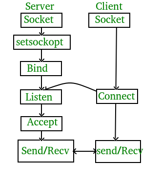

# Report 3 | Socket Programming (Transport Layer)

 

Redes y Sistemas Distribuidos - ESIT (Escuela superior de Ingeniería y Tecnología) ULL

 
 
 
 
 
 
 

 
 
 
 
 
 
 

    Report made by Éric Dürr Sierra and Noah Sánchez
                   (alu0101027005)     (alu0101134956)
 
 
 
 

<!-- end of cover page --->
***

The following document contains the sections which will introduce the different stages of the assignment of *socket programming* ( 3rd assignment ). All you will see
along this report will reffer to concepts of the fifth TCP/IP network layer ( Transport ).

This document will also include evidences of the teamwork ( as done in previous reports ) and a list of the system functions used for this assignment code.

 
 
 

## **Index** &emsp;&emsp;&emsp;&emsp;&emsp;&emsp;&emsp;&emsp;&emsp;&emsp;&emsp;&emsp;&emsp;&emsp;&emsp;&emsp;&emsp;&emsp;&emsp;&emsp;&emsp;&emsp;&emsp;&emsp;&emsp;Page:
 

## 1. [Description of developed aplications](#id1)
## 2. [Description of developed protocol](#id2)
## 3. [Guide for compilation and execution steps](#id3)
## 4. [Test cases](#id4)
## 5. [Appendix: Source code](#id5)

 
 
 
 
 
 
 
 
 
 
 
 
 
 
 
 
 
 
 
 

***

<!-- end of index page --->
 
 
 
 
 

## 1. Description of developed aplications.
 
 

 
 
 
 

## 2. Description of developed protocol.
 
 

FTP is the protocol involved in this project, but what is actually FTP?

FTP stands for “File Transfer Protocol.” It’s also one of the oldest protocols in use today, and is a convenient way to move files around. An FTP server offers access to a directory, with sub-directories. Users connect to these servers with an FTP client, a piece of software that lets you download files from the server, as well as upload files to it.

FTP is one of the simplest, and earliest formats created to quickly move files from one device to another. In the 1980s, the FTP format was updated to the TCP/IP version associated with servers.

When files are transferred through FTP, one of two actions is happening – uploading or downloading. Uploading involves transferring files from a personal computer to a server. FTP uses TCP/IP, as mencioned before, to transfer your files. TCP/IP is basically the language that the Internet uses to carry out commands.

FTP may run in active or passive mode, which determines how the data connection is established. In both cases, the client creates a TCP control connection from a random, usually an unprivileged, port N to the FTP server command port 21.

In active mode, the client starts listening for incoming data connections from the server on port M. It sends the FTP command PORT M to inform the server on which port it is listening. The server then initiates a data channel to the client from it´s port 20, the FTP server data port.

In situations where the client is behind a firewall and unable to accept incoming TCP connections, passive mode may be used. In this mode, the client uses the control connection to send a PASV command to the server and then receives a server IP address and server port number from the server, which the client then uses to open a data connection from an arbitrary client port to the server IP address and server port number received.

Both modes were updated in late nineties to support IPv6. Further changes were introduced to the passive mode at that time, updating it to extended passive mode.

To get this FTP protocol up and running on our project, we had to use Socket programming, so we can create TCP sockets, so then, we had the tools to access a server. One socket (node) listens on a particular port at an IP, while other socket reaches out to the other to form a connection. Server forms the listener socket while client reaches out to the server.

Stages of the TCP Server in Socket Programming:

* **Socket Creation**, with the information of the protocol that is going to be used in the TCP socket.
* **Bind**, bind function binds the socket to the address and port number specified in addr.
* **Listen**, puts the server socket in a passive mode, where it waits for the client to approach the server to make a connection.
* **Accept**, It extracts the first connection request on the queue of pending connections for the listening socket, creates a new connected socket, and returns a new file descriptor referring to that socket. At this point, connection is established between client and server, and they are ready to transfer data.
* **Connect**, the connect() system call connects the socket referred to by the file descriptor sockfd to the address specified by addr.

Stages of the TCP Client in Socket Programming:

* **Socket Creation**, with the information of the protocol that is going to be used in the TCP socket.
* Conect the client to the server.

 
 
 
 

## 3. Guide for compilation and execution steps
 
 

 
 
 
 

## 4. Test cases
 
 

 
 
 
 

## 5. Appendix: Source code.
 
 

 
 
 
 
